.. _gui_manual:

User Interface
==============
**User manual for Defermi's graphical user interface**

.. image:: https://static.streamlit.io/badges/streamlit_badge_black_white.svg
   :target: https://defermi.streamlit.app/

.. image:: https://img.shields.io/badge/github-repo-blue?logo=github
   :target: https://github.com/lorenzo-villa-hub/defermi-gui

.. image:: https://img.shields.io/pypi/v/defermi-gui
   :target: https://pypi.org/project/defermi-gui/

|

.. image:: ./images/main.png
   :width: 70%
   :align: center

Index
-----

- `Running the app`_
- `Getting started`_
- `Sidebar`_
- `Pages`_

Running the app
---------------

**Online**

The ``defermi`` app can be run online (no installation) at this link: `https://defermi.streamlit.app/ <https://defermi.streamlit.app/>`_

**Locally**

The app can also be run locally offline. Install it with ``pip``:

.. code-block:: bash

    pip install defermi-gui

Launch the app by running this in the terminal:

.. code-block:: bash

    defermi-gui

Getting started
---------------

The philosophy of point-defects thermodynamics is to collectively analyse a collection 
of individual defect calculations. The app loads data relative to this collection of defects.
Load a preset from the `Home`_ page to get started. 

Click on `Data`_ to view the raw dataset. Every cell can be modified (like an Excel table).

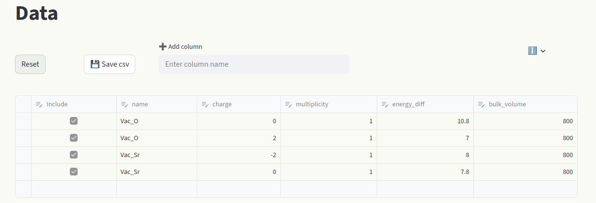

Modify chemical potentials in the `Sidebar`_ or pull them from the `Materials Project <https://next-gen.materialsproject.org/>`_ database. 

.. list-table::
   :width: 100%
   :class: borderless

   * - .. image:: ./images/sidebar/chempots.png
          :width: 100%
         
     - .. image:: ./images/sidebar/chempots_MP_elemental.png
          :width: 100%

View formation energy vs Fermi level plots by clicking on the `Formation energies`_ page. 

|

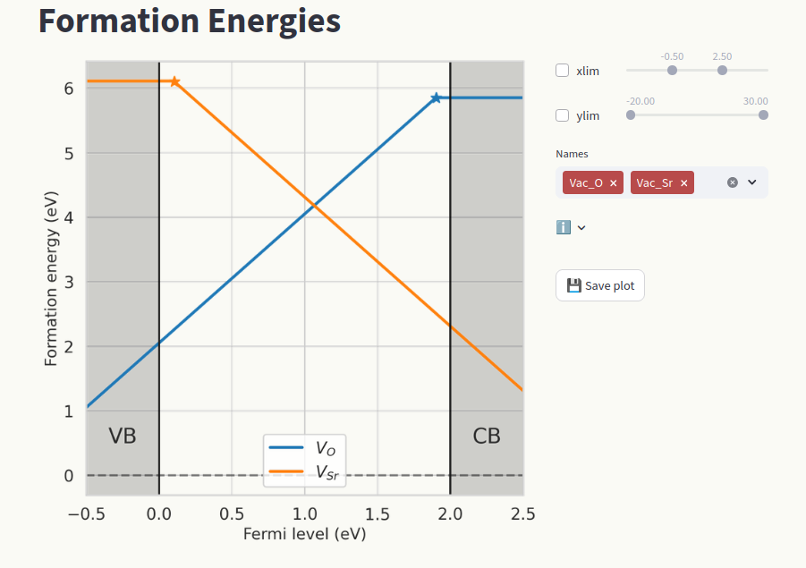

Sidebar
=======

The top half of the sidebar contains the page navigation menu (more details in the `Pages`_ section),
the bottom half contains parameters that are common for different pages. 

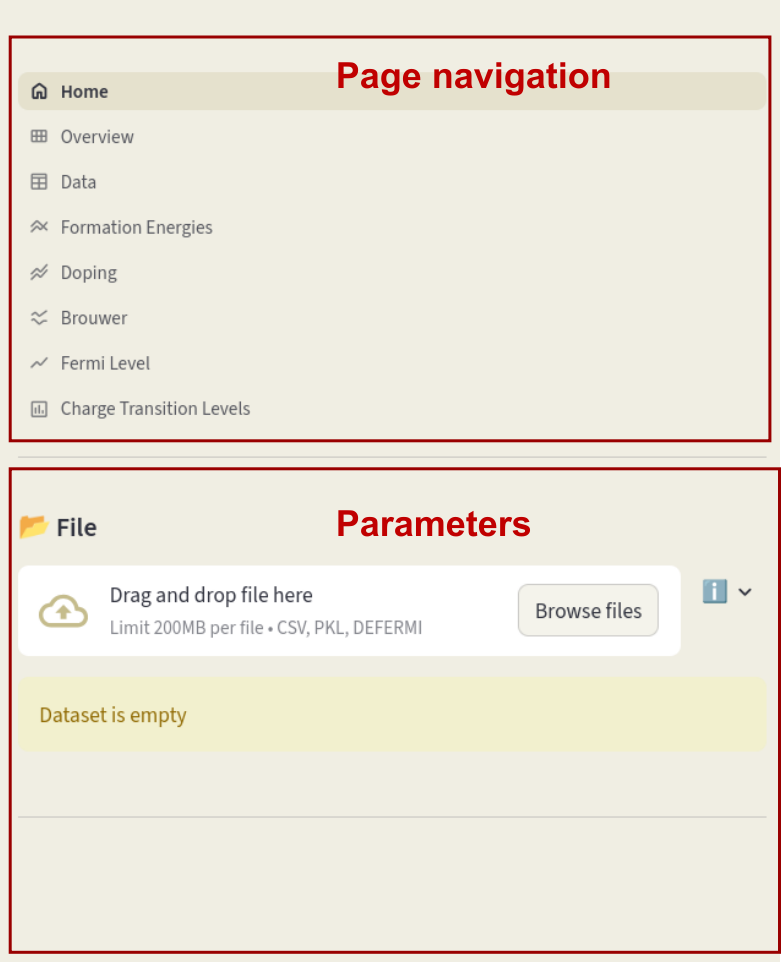

Once a dataset (or a preset) is loaded, the following parameters will appear in the bottom half of the sidebar:

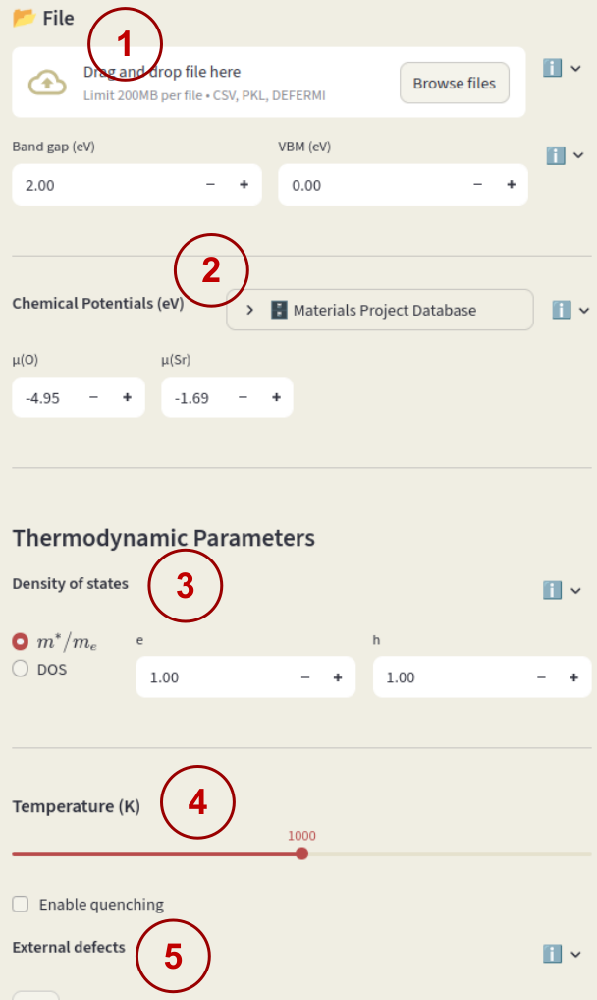

1) `File uploader`_

Load a session file (``.defermi``) or data file (``.csv`` or ``.pkl``). Data will appear in the `Data`_ page. 
``csv`` files or python's ``DataFrame`` objects (if using ``pkl`` files) must contain the following columns:

- ``name`` : Name of the defect, naming conventions described below.
- ``charge`` : Defect charge.
- ``multiplicity`` : Multiplicity in the unit cell.
- ``energy_diff`` : Energy of the defective cell minus the energy of the pristine cell in eV.
- ``bulk_volume`` : Pristine cell volume in :math:`\mathrm{\AA^3}`

Additionally, you can include correction terms by adding columns named
``corr_{insert corr name}`` (e.g. ``corr_elastic``). Each value in columns with
this name will be added to the formation energy.

**Defect naming** (element = :math:`A`)

- Vacancy: ``Vac_A`` (symbol = :math:`V_{A}`)
- Interstitial: ``Int_A`` (symbol = :math:`A_{i}`)
- Substitution: ``Sub_B_on_A`` (symbol = :math:`B_{A}`)
- Polaron: ``Pol_A`` (symbol = :math:`A_{A}`)
- Defect complex: ``Vac_A;Int_A`` (symbol = :math:`V_A - A_i`)

If not loading a session file, you must enter also **Band gap** and **VBM** (valence band maximum) to start the session.

2) `Chemical potentials`_

Chemical potential of the elements that are exchanged with a reservoir when
defects are formed.

Formation energies depend on the chemical potentials as:

.. math::

    \Delta E_f = E_D - E_B + q(\epsilon_{VBM} + \epsilon_F)
    - \color{blue}{\sum_i \Delta n_i \mu_i}

where :math:`\Delta n_i` is the number of particles in the defective cell minus
the number in the pristine cell for species :math:`i`.

Insert the chemical potentials for each species in the input boxes.

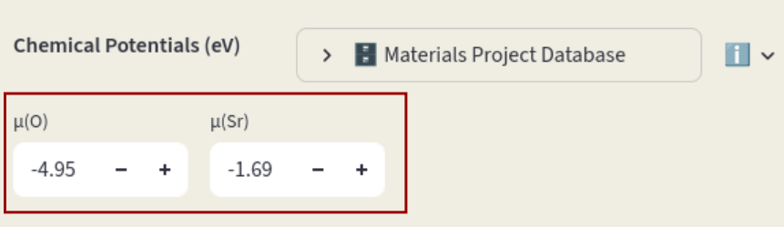

Chemical potentials can also be pulled from the **Materials Project Database**;
click **Materials Project Database** to open the window. If
**Reference composition** is left empty, chemical potentials relative to the
elemental phases are pulled. Click on the arrow to open the database window. Leave the
**Reference composition** empty and click on **Pull**.

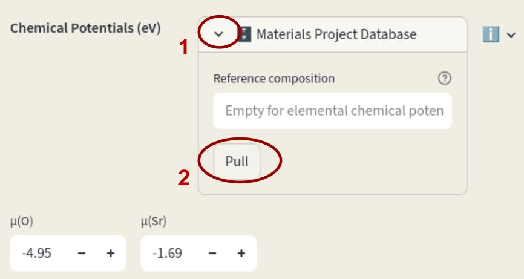

If a composition is specified, the phase diagram
relative to the components in the target phase is retrieved, and a dialog will
appear to select which element and which condition should be used as reference. 

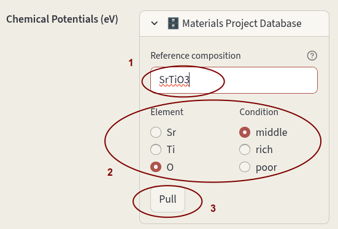

Enter the desired composition in **Reference composition**, select the **Element** 
and **Condition** and click on **Pull**.

3) `Density of states`_

Density of states (DOS) to use for the calculation of electrons and holes concentrations. Select between:

- Effective masses
- DOS file

Select the first option for the effective mass and enter the values for electrons (**e**) and holes (**h**) 
in units of electron mass.

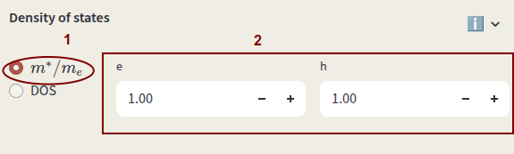

Select the second option to use an actual DOS file. It can be pulled from the MP database by clicking on the
arrow next to **Database**, enter the bulk **Composition** and click **Pull**.

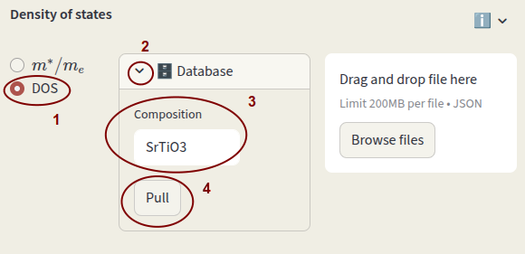

Alternatively, you can provide your DOS file in ``json`` format. It can be a pymatgen `Dos` object
(``Dos``, ``CompleteDos``, or ``FermiDos``) exported as ``json`` or a python dictionary in the following format:

    - ``energies`` : list or ``np.array`` with energy values
    - ``densities`` : list or ``np.array`` with total density values
    - ``structure`` : pymatgen ``Structure`` of the material, needed for DOS volume and charge normalization

Click on **Browse files** or drag and drop file.

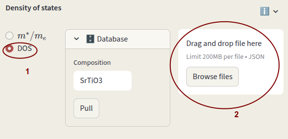

4) `Temperature`_

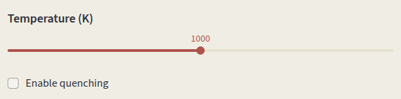

Set the simulation **Temperature**. Temperature-dependent parameters are:

- Defect concentrations
- Carrier concentrations
- Oxygen chemical potential

Click on **Enable quenching** to perform a quenched simulation. 
Defect concentrations are computed under charge-neutral conditions at the input
**Temperature (K)**, but charges are equilibrated at the **Quench Temperature
(K)**. This simulates conditions where defect mobility is low and the
high-temperature defect distribution is frozen in at low temperature.

**Quenching mode** options:

- **species**
  Fix concentrations of defect species (identified by ``name``).

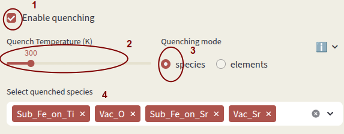

- **elements**
  Fix concentrations of elements. Concentrations of individual species
  containing the quenched elements are computed according to the relative
  formation energies. Vacancies are considered separate elements.

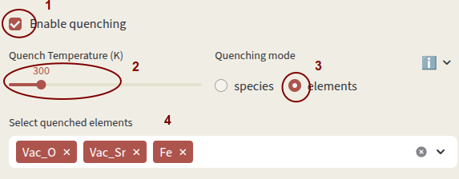

Select which species or elements to quench with **Select quenched species**.
Defects not in the quenching list are equilibrated at the **Quench Temperature**.

5) `External defects`_

Include extrinsic defects contributing to charge neutrality that are NOT present in
the defect entries.

They are considered in the Brouwer diagram and doping diagram calculations.
There is no requirement for the defect name; if a name fits one of the naming
conventions, the corresponding symbol will be printed.

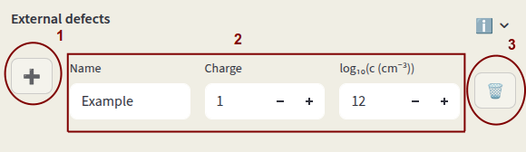

Click on + to add an external defect. Enter **Name**, **Charge** and 
**Concentration** (power of 10, units are :math:`\mathrm{cm^{-3}}`).
Click on 🗑️ to delete the entry.

File uploader
-------------

Chemical potentials
-------------------

Density of states
-----------------

Temperature
-----------

External defects
----------------

Pages
=====

- `Home`_
- `Overview`_
- `Data`_
- `Formation energies`_
- `Doping`_
- `Brouwer`_
- `Fermi level`_
- `Charge transition levels`_
- `Binding energies`_

Home
----

Overview
--------

Data
----

Formation energies
------------------

Doping
------

Brouwer
-------

Fermi level
-----------

Charge transition levels
------------------------

Binding energies
----------------
