.. _gui_manual:

User Interface
==============
**User manual for Defermi's graphical user interface**

.. image:: https://static.streamlit.io/badges/streamlit_badge_black_white.svg
   :target: https://defermi.streamlit.app/

.. image:: https://img.shields.io/badge/github-repo-blue?logo=github
   :target: https://github.com/lorenzo-villa-hub/defermi-gui

.. image:: https://img.shields.io/pypi/v/defermi-gui
   :target: https://pypi.org/project/defermi-gui/

|

.. image:: ./images/main.png
   :width: 70%
   :align: center

Index
-----

- `Running the app`_
- `Getting started`_
- `Sidebar`_
- `Pages`_

Running the app
---------------

**Online**

The ``defermi`` app can be run online (no installation) at this link: `https://defermi.streamlit.app/ <https://defermi.streamlit.app/>`_

**Locally**

The app can also be run locally offline. Install it with ``pip``:

.. code-block:: bash

    pip install defermi-gui

Launch the app by running this in the terminal:

.. code-block:: bash

    defermi-gui

Getting started
---------------

The philosophy of point-defects thermodynamics is to collectively analyse a collection 
of individual defect calculations. The app loads data relative to this collection of defects.
Load a preset from the `Home`_ page to get started. 

.. image:: ./images/home/presets.png
   :width: 80%
   :align: center

Click on `Data`_ to view the raw dataset. Every cell can be modified (like an Excel table).

.. image:: ./images/data/data.png
   :width: 80%
   :align: center

Modify chemical potentials in the `Sidebar`_ or pull them from the `Materials Project <https://next-gen.materialsproject.org/>`_ database. 

.. list-table::
   :width: 100%
   :class: borderless

   * - .. image:: ./images/sidebar/chempots.png
          :width: 100%
         
     - .. image:: ./images/sidebar/chempots_MP_elemental.png
          :width: 100%

View formation energy vs Fermi level plots by clicking on the `Formation energies`_ page. 

|

.. image:: ./images/formation-energies/formation_energies.png
   :width: 70%
   :align: center

Sidebar
=======

The top half of the sidebar contains the page navigation menu (more details in the `Pages`_ section),
the bottom half contains parameters that are common for different pages. 

.. image:: ./images/sidebar/sidebar_main_top_bottom.png
   :width: 50%
   :align: center

Once a dataset (or a preset) is loaded, the following parameters will appear in the bottom half of the sidebar:

.. image:: ./images/sidebar/sidebar_main_bottom.png
   :width: 40%
   :align: center

1) `File uploader`_
2) `Chemical potentials`_
3) `Density of states`_
4) `Temperature`_
5) `External defects`_

File uploader
-------------
Load a session file (``.defermi``) or data file (``.csv`` or ``.pkl``). Data will appear in the `Data`_ page. 
``csv`` files or python's ``DataFrame`` objects (if using ``pkl`` files) must contain the following columns:

- ``name`` : Name of the defect, naming conventions described below.
- ``charge`` : Defect charge.
- ``multiplicity`` : Multiplicity in the unit cell.
- ``energy_diff`` : Energy of the defective cell minus the energy of the pristine cell in eV.
- ``bulk_volume`` : Pristine cell volume in :math:`\mathrm{\AA^3}`

Additionally, you can include correction terms by adding columns named
``corr_{insert corr name}`` (e.g. ``corr_elastic``). Each value in columns with
this name will be added to the formation energy.

**Defect naming** (element = :math:`A`)

- Vacancy: ``Vac_A`` (symbol = :math:`V_{A}`)
- Interstitial: ``Int_A`` (symbol = :math:`A_{i}`)
- Substitution: ``Sub_B_on_A`` (symbol = :math:`B_{A}`)
- Polaron: ``Pol_A`` (symbol = :math:`A_{A}`)
- Defect complex: ``Vac_A;Int_A`` (symbol = :math:`V_A - A_i`)

If not loading a session file, you must enter also **Band gap** and **VBM** (valence band maximum) to start the session.

Chemical potentials
-------------------
Chemical potential of the elements that are exchanged with a reservoir when
defects are formed.

Formation energies depend on the chemical potentials as:

.. math::

    \Delta E_f = E_D - E_B + q(\epsilon_{VBM} + \epsilon_F)
    - \color{blue}{\sum_i \Delta n_i \mu_i}

where :math:`\Delta n_i` is the number of particles in the defective cell minus
the number in the pristine cell for species :math:`i`.

Insert the chemical potentials for each species in the input boxes.

.. image:: ./images/sidebar/chempots.png
   :width: 50%
   :align: center

Chemical potentials can also be pulled from the **Materials Project Database**;
click **Materials Project Database** to open the window. If
**Reference composition** is left empty, chemical potentials relative to the
elemental phases are pulled. Click on the arrow to open the database window. Leave the
**Reference composition** empty and click on **Pull**.

.. image:: ./images/sidebar/chempots_MP_elemental.png
   :width: 50%
   :align: center

If a composition is specified, the phase diagram
relative to the components in the target phase is retrieved, and a dialog will
appear to select which element and which condition should be used as reference. 

.. image:: ./images/sidebar/chempots_MP_reference.png
   :width: 50%
   :align: center

Enter the desired composition in **Reference composition**, select the **Element** 
and **Condition** and click on **Pull**.

Density of states
-----------------
Density of states (DOS) to use for the calculation of electrons and holes concentrations. Select between:

- Effective masses
- DOS file

Select the first option for the effective mass and enter the values for electrons (**e**) and holes (**h**) 
in units of electron mass.

.. image:: ./images/sidebar/dos_meff.png
   :width: 50%
   :align: center

Select the second option to use an actual DOS file. It can be pulled from the MP database by clicking on the
arrow next to **Database**, enter the bulk **Composition** and click **Pull**.

.. image:: ./images/sidebar/dos_MP.png
   :width: 50%
   :align: center

Alternatively, you can provide your DOS file in ``json`` format. It can be a pymatgen `Dos` object
(``Dos``, ``CompleteDos``, or ``FermiDos``) exported as ``json`` or a python dictionary in the following format:

    - ``energies`` : list or ``np.array`` with energy values
    - ``densities`` : list or ``np.array`` with total density values
    - ``structure`` : pymatgen ``Structure`` of the material, needed for DOS volume and charge normalization

Click on **Browse files** or drag and drop file.

.. image:: ./images/sidebar/dos_file.png
   :width: 50%
   :align: center

Temperature
-----------
.. image:: ./images/sidebar/temperature.png
   :width: 50%
   :align: center

Set the simulation **Temperature**. Temperature-dependent parameters are:

- Defect concentrations
- Carrier concentrations
- Oxygen chemical potential

Click on **Enable quenching** to perform a quenched simulation. 
Defect concentrations are computed under charge-neutral conditions at the input
**Temperature (K)**, but charges are equilibrated at the **Quench Temperature
(K)**. This simulates conditions where defect mobility is low and the
high-temperature defect distribution is frozen in at low temperature.

**Quenching mode** options:

- **species**
  Fix concentrations of defect species (identified by ``name``).

.. image:: ./images/sidebar/temperature_quenching.png
   :width: 50%
   :align: center

- **elements**
  Fix concentrations of elements. Concentrations of individual species
  containing the quenched elements are computed according to the relative
  formation energies. Vacancies are considered separate elements.

.. image:: ./images/sidebar/temperature_quenching_elements.png
   :width: 50%
   :align: center

Select which species or elements to quench with **Select quenched species**.
Defects not in the quenching list are equilibrated at the **Quench Temperature**.

External defects
----------------
Include extrinsic defects contributing to charge neutrality that are NOT present in
the defect entries.

They are considered in the Brouwer diagram and doping diagram calculations.
There is no requirement for the defect name; if a name fits one of the naming
conventions, the corresponding symbol will be printed.

.. image:: ./images/sidebar/external.png
   :width: 50%
   :align: center

Click on + to add an external defect. Enter **Name**, **Charge** and 
**Concentration** (power of 10, units are :math:`\mathrm{cm^{-3}}`).
Click on 🗑️ to delete the entry.

Pages
=====

Pages provide navigation though different sections of the program. Click on pages to 
access and interact with each section. Settings are stored when changing page. Save the 
session state with the **Save session** button and load it using the `File uploader`_.

The documentation for each page is provided below.

- `Home`_
- `Overview`_
- `Data`_
- `Formation energies`_
- `Doping`_
- `Brouwer`_
- `Fermi level`_
- `Charge transition levels`_
- `Binding energies`_

Home
----

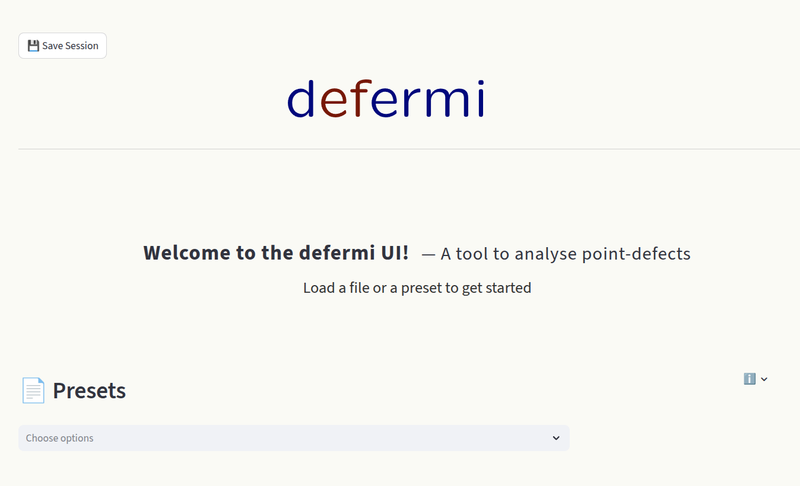

This page is loaded when the app is launched. Choose a preset to load an example dataset 
to get started and experiment with the different functionalities.

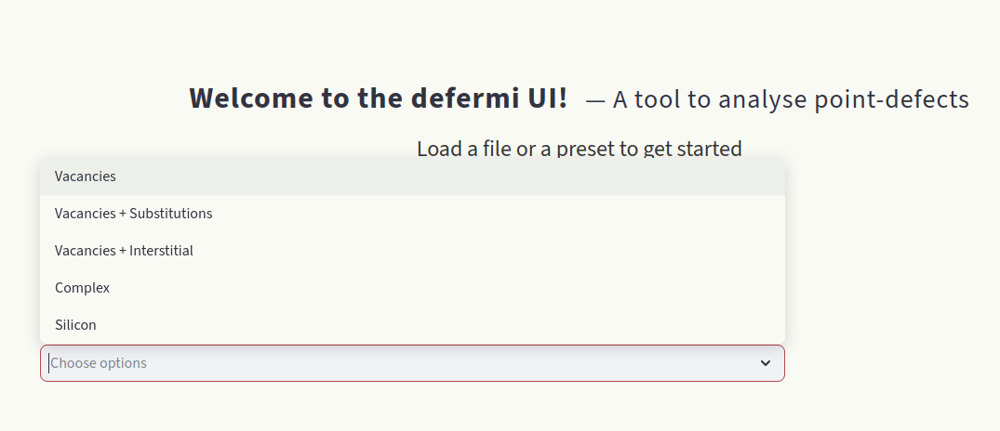

Overview
--------

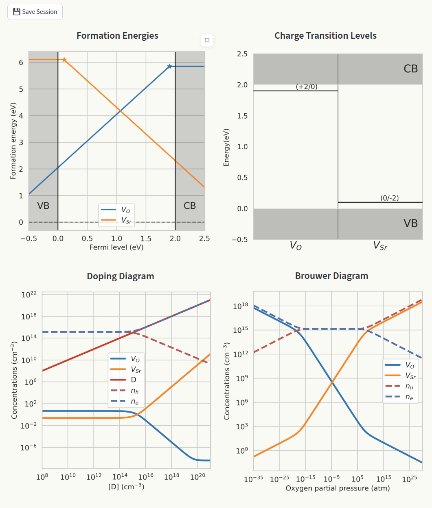

Shows the main generated plots in the same window:

- `Formation energies`_
- `Charge transition levels`_
- `Doping diagram <doping_>`_
- `Brouwer diagram <brouwer_>`_

Formation energies and charge transition levels are generated automatically when interacting
with any parameter in the app. Doping and Brouwer diagrams are generated when navigated to 
their respective pages.

Data
----

.. image:: ./images/data/data.png
   :width: 50%
   :align: center

The **Data** section contains all the information relative to each point defect, in each charge state. 
Each box can be edited, like an Excel table. A row represents the data of one individual 
defect calculation (entry). Toggle the **Include** box to add or remove the defect entry
from the calculations. Hover over column names to display a short info box. Visit
the `File uploader`_ section for detailed information on the data formatting and column meanings.

Hover over the last empty row and click to add a row.

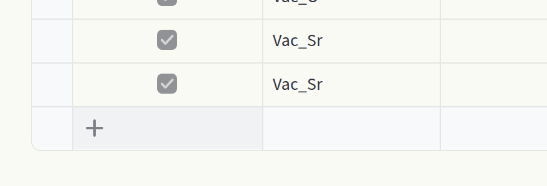

Above the spreadsheet you find additional options:

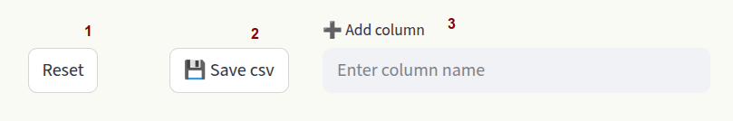

- **1) Reset**
  Restore the original dataset.

- **2) Save csv**
  Save the customized dataset as a ``csv`` file.

- **3) Add column**
  Add a column to the dataset.

To delete rows, click on the far left side of the spreadsheet to select rows (1), then click on 🗑️
in the top right area.

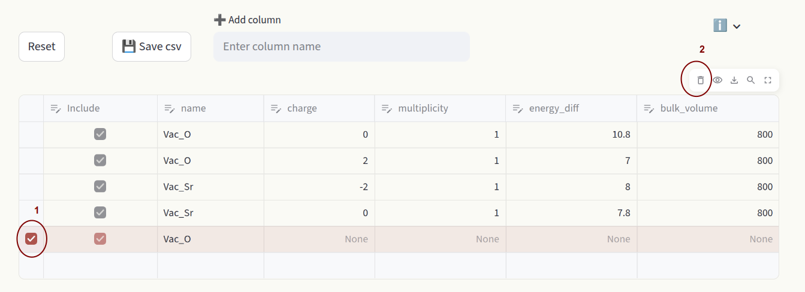

Formation energies
------------------

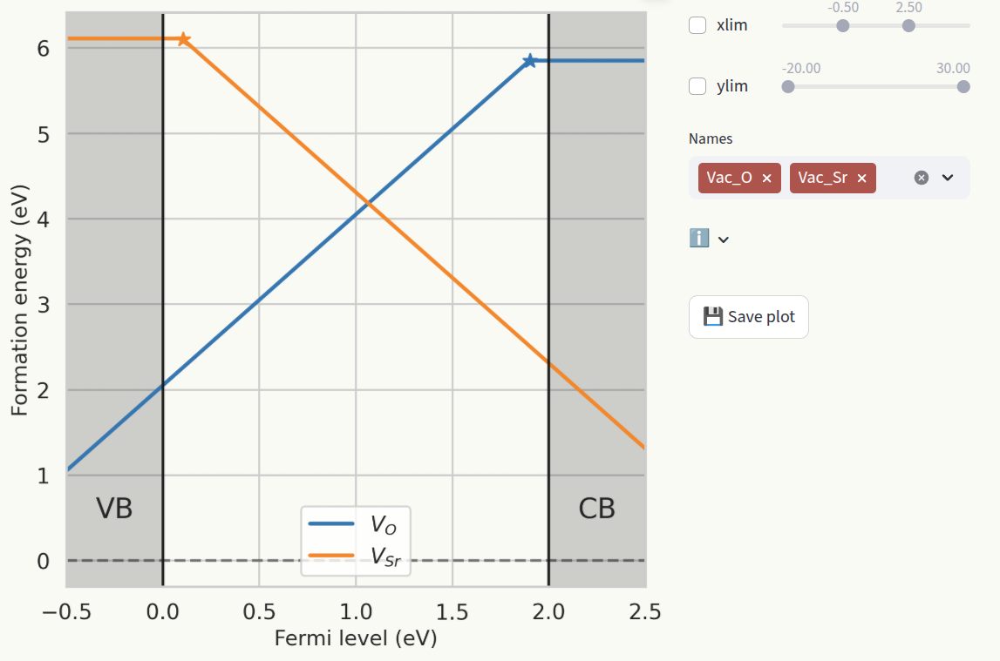

Formation energies represent the energetic cost of forming a defect. Assuming that formation energies do 
not heavily depend on temperature and formation volume, they are calculated as:

.. math::

    \Delta E_f = E_D - E_B + q(\epsilon_{VBM} + \epsilon_F)
    - \sum_i \Delta n_i \, \mu_i + E_{corr}

where:

- :math:`E_D` is the energy of the defective cell
- :math:`E_B` is the energy of the pristine cell
- :math:`q` is the charge
- :math:`\epsilon_{VBM}` is the valence band maximum
- :math:`\epsilon_F` is the Fermi level
- :math:`\Delta n_i` is the particle number difference between the defective
  and pristine cells
- :math:`\mu_i` is the chemical potential of particle :math:`i`
- :math:`E_{corr}` are finite-size correction terms

:math:`E_D - E_B` corresponds to the ``energy_diff`` column in the `Data`_ section. 
Chemical potentials are defined in the `Chemical potentials`_ section of the `Sidebar`_.
The conventional approach to show formation energies is to plot them as a function of the fermi level 
:math:`\epsilon_F`, which produces lines with slopes equal to the defect charge. For each defect, only 
the lowest formation energy line is shown, and slope changes indicate `Charge transition levels`_.

Customize the axis ranges (1) and which defect species are shown (2). Click on **Save plot** to save 
the figure as ``pdf`` file (3).

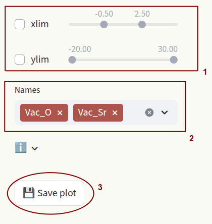

.. _doping:

Doping
------

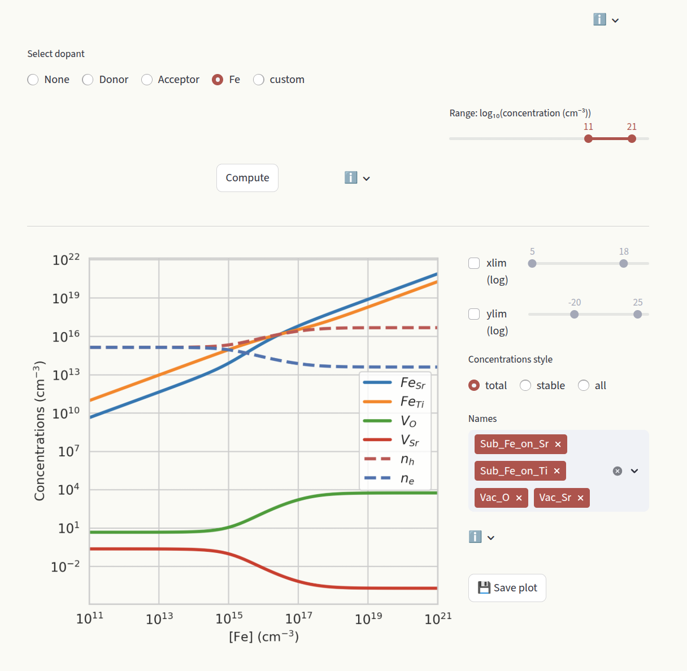

The doping section aims at studying the effect of doping on the system, by evaluating how the defect 
concentrations change as a function of doping concentrations. Select which dopant to evaluate under 
the **Select dopant** window. 

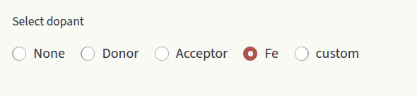

Options are:

- **None**: Do not compute doping diagram.
- **Donor**: Generic donor with fixed charge. Enter the charge in the **Charge** input box.
- **Acceptor**: Generic acceptor with fixed charge. Enter the charge in the **Charge** input box.
- **<element>**: Extrinsic species present in our defect entries. Displayed options depend on the defect entries in `Data`_ section.
- **custom**: Create a dummy species. Customize **Name** and **Charge**.

Depending on your system, the calculation could take a couple of seconds. Therefore, the plot is not generated at
every user interaction, but is the calculation result is cached. Click on **Compute** to re-run the calculation when you change 
parameters. Set the desired concentration range with the slider:

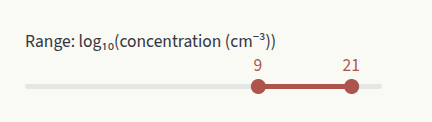

Set the axis limits with the sliders **xlim** and **ylim**, like for `Formation energies`_. Choose how to display defect
concentrations by setting the **Concentrations style** window.

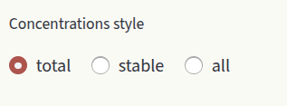

Options are:

- **total**: Show the sum of concentrations in all charge states for each defect species. When the stable charge changes, the new charge number is shown in the plot.

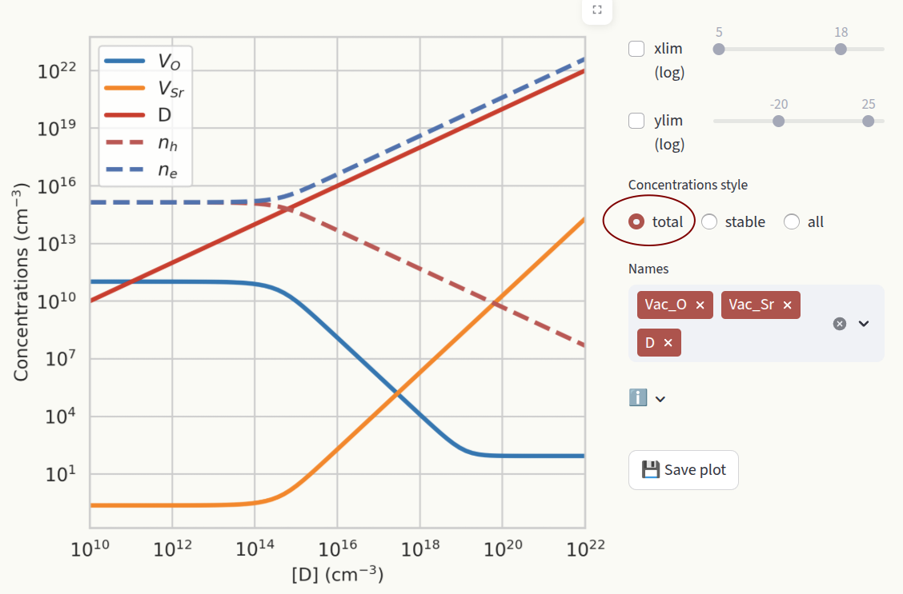

- **stable**: Show the concentration of the most stable charge state for each defect species.

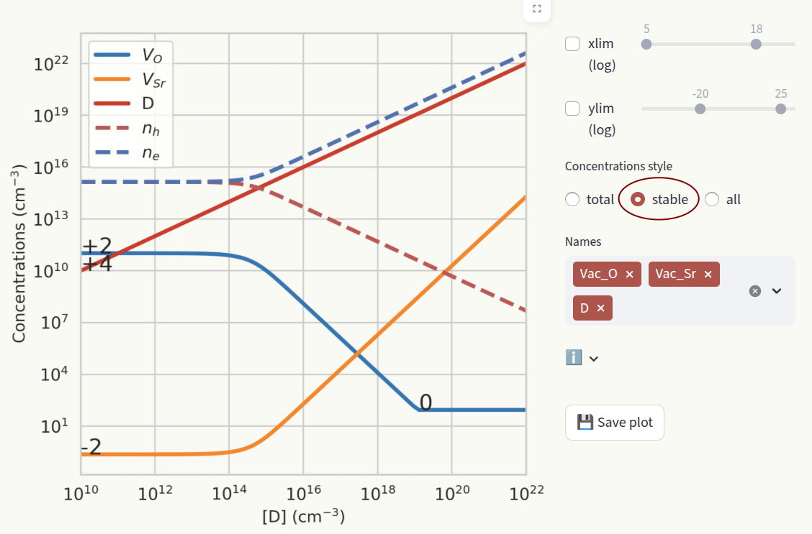

- **all**: Show the concentrations of all charge states for all defect species. Filter which charge states to show by typing them in the textbox.

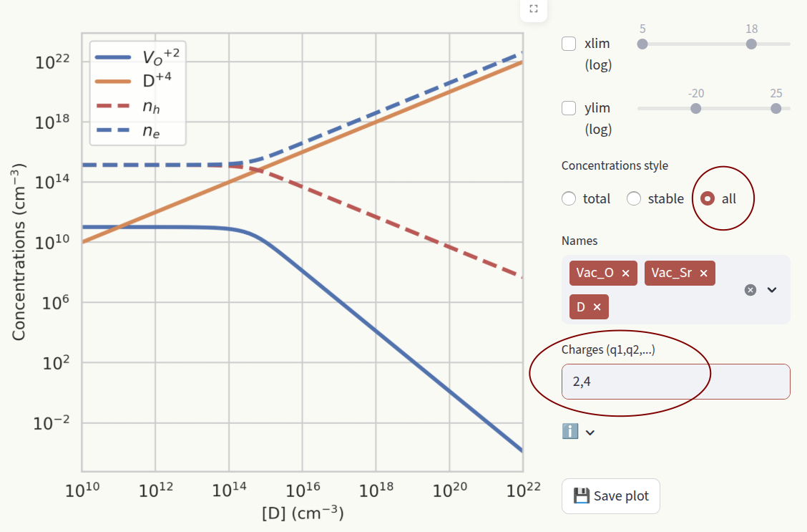

.. _brouwer:

Brouwer
-------

Fermi level
-----------

Charge transition levels
------------------------

Binding energies
----------------
