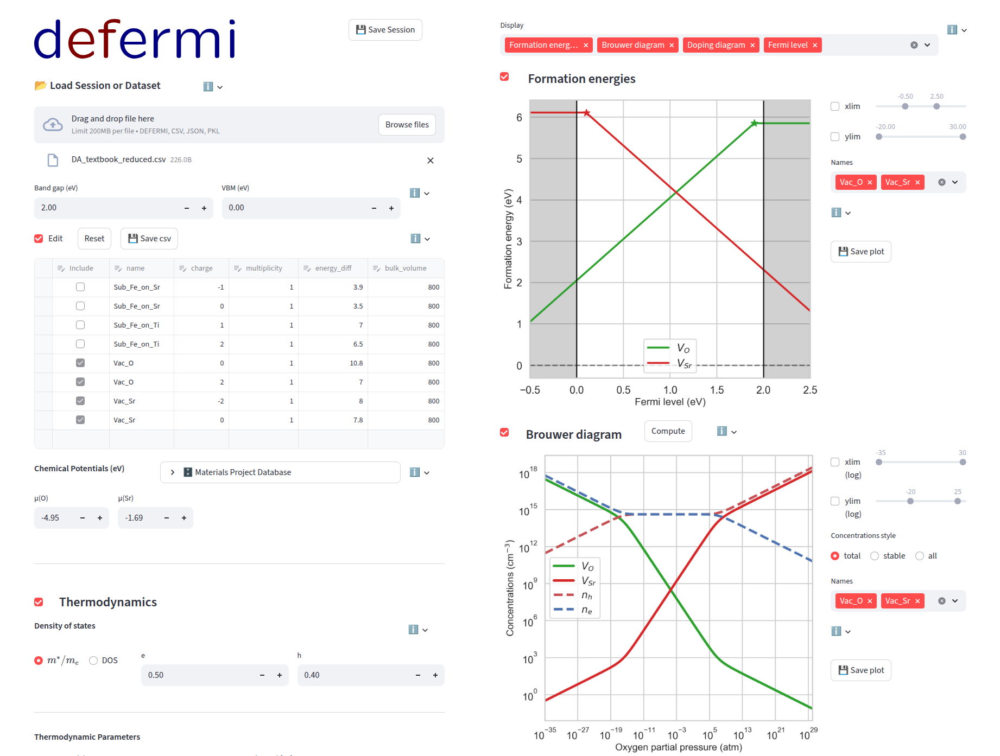

.. raw:: html

   

     
     
   

defermi
=======

Python library for the analysis and visualization of point defects. Simple and intuitive for new users and non-experts, flexible and customizable for power users.

UI
==

.. image:: https://static.streamlit.io/badges/streamlit_badge_black_white.svg
   :target: https://defermi.streamlit.app/

.. image:: https://img.shields.io/badge/github-repo-blue?logo=github
   :target: https://github.com/lorenzo-villa-hub/defermi-gui

.. image:: https://img.shields.io/pypi/v/defermi-gui
   :target: https://pypi.org/project/defermi-gui/

The library comes with a simple and intuitive graphical user interface.  
It runs in the browser without installation at: https://defermi.streamlit.app/

Features
========

- **Formation energies**: Easily calculate and plot formation energies of point defects.
- **Charge transition levels**: Compute and visualize defect thermodynamic transition levels.
- **Chemical potentials**: Generate, analyse and visualize datasets of chemical potentials. Automated workflow for datasets generations based on oxygen partial pressures.
- **Defect complexes**: Support for defect complexes is included.
- **Equilibrium Fermi level**: Compute the Fermi level dictated by charge neutrality self-consistently.
- **Brouwer and doping diagrams**: Automatic generation of Brouwer diagrams and doping diagrams.
- **Temperature-dependent formation energies and defect concentrations**: System-specific temperature-dependence of formation energies and defect concentrations can be included and customized.
- **Extended frozen defects approach**:  
  Calculate Fermi level under non-equilibrium conditions, fixing defect concentrations to target values while allowing charge to equilibrate.  
  Useful for quenched conditions, extrinsic defects, partial quenching, and elemental concentration constraints.
- **Finite-size corrections**: Compute charge corrections (FNV and eFNV schemes), currently for ``VASP`` using ``pymatgen``.
- **Automatic import from VASP calculations**: Import datasets directly from VASP calculation folders. Support for ``gpaw`` coming soon.

Overview
========

- **Intuitive**: All main functionalities are wrapped in the ``DefectsAnalysis`` class — no need to dig through deep documentation.
- **Easy interface**: Works with simple objects (``list``, ``dict``, ``DataFrame``). Getting started is as easy as loading a ``csv`` file.
- **Flexible**: Power users can customize every step; routines are available individually for full control.
- **Customizable**: Users can supply their own formation-energy and concentration models, including temperature/volume dependence and system-specific behaviors.

.. toctree::
   :hidden:
   :maxdepth: 4

   Home <self>
   Installation
   getting_started/index
   User Interface <gui_manual/gui_manual>
   advanced/index
   Contributing
   API <api>
