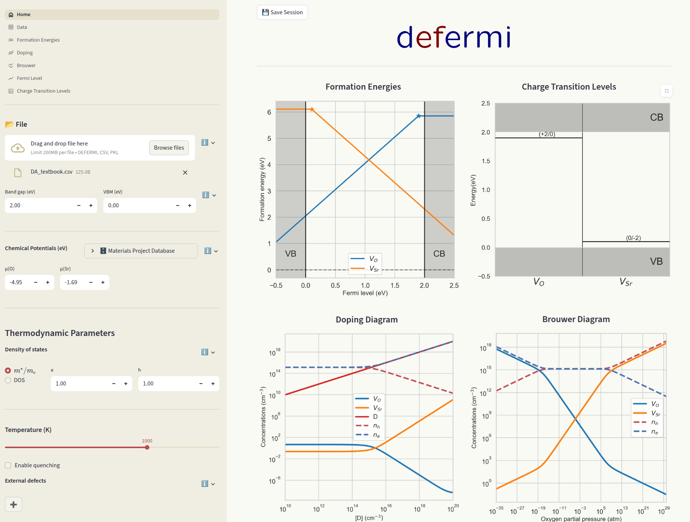

# Defermi UI - User Manual
[](https://defermi.streamlit.app/) 
[](https://github.com/lorenzo-villa-hub/defermi-gui)
[](https://pypi.org/project/defermi-gui/)


{.bg-warning w=500px align=center}


`defermi` comes with a User Interface (UI). The main workflows from the python library are available. 

## Index

- [**Running the app**](#running-the-app)
- [**Getting started**](#getting-started)
- [**Sidebar**](#sidebar) 
- [**Pages**](#pages)

## Running the app

### Remotely
The `defermi` app can be run remotely (no installation) at this link: https://defermi.streamlit.app/

### Locally
The app can also be run locally offline. Install it with `pip`:

```bash
pip install defermi-gui
```
Launch the app by running this in the terminal: 

```bash
defermi-gui
```

## Getting started

The philosophy of point-defects thermodynamics is to collectively analyse a collection of individual defect calculations. The app loads data relative to this collection of defects, and 

## Sidebar

## Pages

- [**Home**](#home)
- [**Overview**](#overview)
- [**Data**](#data)
- [**Formation energies**](#overview)
- [**Doping**](#doping)
- [**Brouwer**](#brouwer)
- [**Fermi level**](#fermi-level)
- [**Charge transition levels**](#charge-transition-levels)
- [**Binding energies**](#binding-energies)


### Home
### Sidebar
### Overview
### Data
### Formation energies
### Doping
### Brouwer
### Fermi level
### Charge transition levels
### Binding energies

